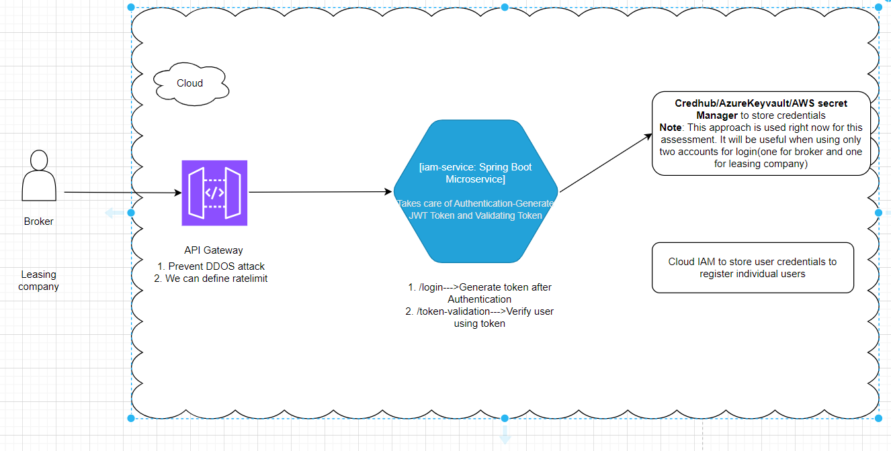

# Introduction
This service takes care of Authentication of users(accounts) to manage data related to car lease
All authentication related logic is implemented in this service by validating JWT token which is created using credentials in this service.

# Endpoints
1. /login endpoint to verify authentication and to generate JWT token
2. /token-validation to verify user authentication using JWT token

# Credentials to login
1. Using broker and leasing-company account credentials users can login and generate token
2. Right now Credentials have been kept in application.yml file. But in rela time if we are using cloud either we use to keep in Credhub/Keyvault/AWS Secrets Manager

# Architecture of this assessment(iam-service)

# Technologies/Frameworks used in local
1. InteliJ Latest version
2. Java 17
3. Maven version 3.9.5
4. Spring Boot Version 3.1.0
5. Lombok
6. Junit
7. Swagger(http://localhost:8080/swagger-ui/index.html)

# How to configure in local
1. Download repo from github
2. Refer # Technologies/Frameworks used in local to download needed software
3. Do 'mvn clean install'
4. Run spring boot main application
5. After app started, use http://localhost:8080/swagger-ui/index.html to login
6. Give either broker or leasing-company credentials(Refer application.yml to get credentials) in username and password of Authorize section
7. Once you have Authorized, click /login endpoint to generate token
8. Copy the token and use it in other microservices swagger page to hit the needed endpoint

# Improvements can be made-Due to time constraints I could not do the below
1. By exposing this microservice to API Gateway , we can configure ratelimit and prevent DDOS attack
2. Due to time constraints, I could not create docker for this.
3. Some validations on the user input fields could have been done by sanitizing the inputs fields to avoid/escape html characters
4. By integrating with Splunk, log can be monitored. Trace id and span id has to be enabled for all services